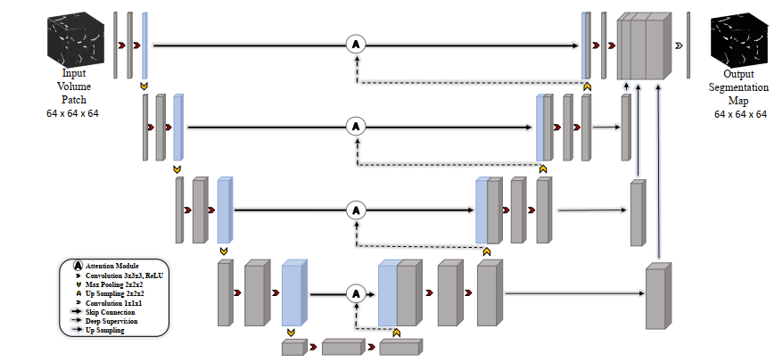
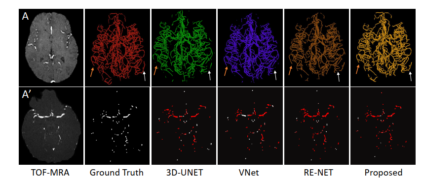
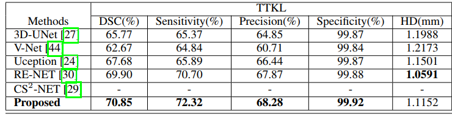

# Vessel Segmentation
This repository contains codes for vessel segmentation for MRA images and can be applied to other 3D datasets.
## Paper Title: 
CV-Attention UNet: Attention-based UNet for 3D Cerebrovascular Segmentation of Enhanced TOF-MRA Images(https://arxiv.org/abs/2311.10224)

## Dataset: https://public.kitware.com/Wiki/TubeTK/Data
## Labeled Dataset by us: TTKL_L
Link: https://drive.google.com/drive/folders/1fpUnzHK5_Csnrc3E6x2jgFHZEDm9aQGX?usp=drive_link
## Preprocessing

Proprocessing is done using the repository: https://github.com/quqixun/BrainPrep


## Patch Generation
First create the csv files contains dataset list of images and labels.
```
python generate_dataframe_path.py
```
And then you can create the 3D patch of your desired size. 

```
python generate_3D_patches.py

```

## Training

There are other architetures as well in architecture/ folder which were most commonly used for segmentation. 
```
python Training.py
```


## Inference
Inference is done using sliding window method.

```
python Inference.py

```
# Results 
Trained Model: See [Trained Model](https://github.com/farhancv09/Vessel_Segmentation/blob/main/trained_model/models.txt).
## Qualitative

## Quantitative


## Citation
If this code or some part of it is useful for your research, please consider citing following paper:
```angular2html
@article{abbas2023cv,
  title={CV-Attention UNet: Attention-based UNet for 3D Cerebrovascular Segmentation of Enhanced TOF-MRA Images},
  author={Abbas, Syed Farhan and Duc, Nguyen Thanh and Song, Yoonguu and Kim, Kyungwon and Lee, Boreom},
  journal={arXiv preprint arXiv:2311.10224},
  year={2023}
}

