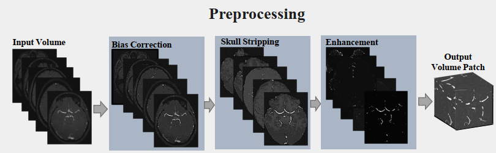

# Vessel Segmentation
This repository contains codes for vessel segmentation for MRA images and can be applied to other 3D datasets.

## Dataset: https://public.kitware.com/Wiki/TubeTK/Data

## Preprocessing

Proprocessing is done using the repository: https://github.com/quqixun/BrainPrep

